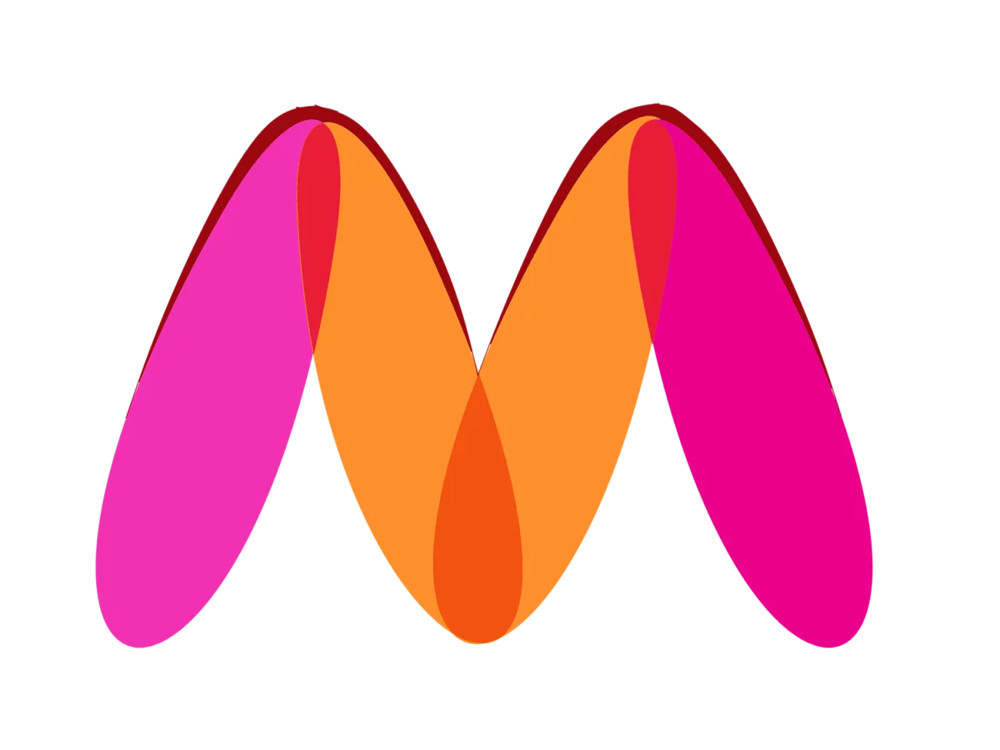

# 🛍️ Myntra Homepage Clone

> A pixel-perfect front-end clone of the **Myntra e-commerce homepage**, built entirely with **HTML** and **CSS**. No JavaScript frameworks — just pure semantic HTML and modern CSS layout techniques.


---

## 📸 Preview

Open `myntra clone.html` in any modern browser to see the clone in action.

```
📁 Myntra clone project/
├── 📄 myntra clone.html      →  Main HTML file (structure)
├── 📄 myntra.css             →  Stylesheet (styling/layout)
├── 📄 Readme.md              →  This file
├── 📁 images/                →  Banner, logo, category & offer images
└── 📁 card html & css/       →  Extra: Profile card UI design
```

---

## ✨ Features

| Feature | Description |
|---------|-------------|
| **Header** | Fixed-style header with logo, navigation, search bar, and action icons |
| **Navigation** | Horizontal nav with hover effects (pink underline) |
| **Search Bar** | Integrated Material Symbols search icon + input field |
| **Banner Section** | Full-width promotional banner image |
| **Category Grids** | Flexbox-based wrapping grid for offers and product categories |
| **Footer** | 4-column footer with links, app badges, social icons, and trust badges |
| **Responsive** | Adaptive layout at **1024px** (tablet) and **768px** (mobile) breakpoints |
| **Material Icons** | Google Material Symbols for all icons throughout the page |

---

## 🛠️ Tech Stack

| Technology | Purpose |
|-----------|---------|
| **HTML5** | Page structure (header, nav, main, footer, sections) |
| **CSS3** | All styling — Flexbox, hover effects, transitions, media queries |
| **Google Material Symbols** | Icons for search, profile, wishlist, heart, social media |

---

## 📂 Project Structure Breakdown

### 🔷 1. HEADER Section (`<header>`)

The top bar contains 4 main parts laid out side-by-side using **Flexbox**:

```
┌────────────────────── HEADER (display: flex) ──────────────────────┐
│                                                                    │
│  [LOGO]  ────  [NAV BAR]  ────  [SEARCH BAR]  ────  [ACTIONS]    │
│                                                                    │
└────────────────────────────────────────────────────────────────────┘
```

**HTML Code:**
```html
<header>
  <!-- 1. LOGO -->
  <div class="logo_container">
    <a href="#"></a>
  </div>

  <!-- 2. NAVIGATION -->
  <nav class="nav_bar">
    <a href="#">Men</a>
    <a href="#">Women</a>
    <a href="#">Kids</a>
    <a href="#">Home & Living</a>
    <a href="#">Beauty</a>
    <a href="#"><sup>New</sup></a>
  </nav>

  <!-- 3. SEARCH BAR -->
  <div class="search_bar">
    <span class="material-symbols-outlined search_icon">search</span>
    <input class="search_input" placeholder="Search for products, brands and more">
  </div>

  <!-- 4. ACTION BAR (Profile, Wishlist, Heart) -->
  <div class="action_bar">
    <div class="action_container">
      <span class="material-symbols-outlined action_icon">person</span>
      <span class="action_name">Profile</span>
    </div>
    ...
  </div>
</header>
```

**CSS Explanation:**
```css
header {
    display: flex;              /* Items sit side-by-side */
    justify-content: space-between;  /* Logo left, Actions right */
    align-items: center;        /* Vertically centered */
    height: 80px;
    border-bottom: 1px solid #b6b1b1;  /* Separator line */
}
```

> 💡 **Think of it like:** A shelf where items are placed from left to right with space between them.

---

### 🔷 2. NAVIGATION — Pink Underline Effect

When you hover over any nav link, a **pink line** appears below it:

```css
.nav_bar a {
    padding: 27px 0;
    border-bottom: 5px solid #ffffff;  /* Hidden white border (placeholder) */
    text-decoration: none;
    font-weight: 700;
    text-transform: uppercase;
    letter-spacing: 3px;
}

.nav_bar a:hover {
    border-bottom: 4px solid #f54e77;  /* Pink underline appears on hover ✨ */
}
```

**"New" Badge in Red:**
```css
.nav_bar a sup {
    color: #ff3f6c;   /* Myntra's signature pink-red */
    font-size: 10px;
}
```

---

### 🔷 3. SEARCH BAR

The search bar has a **search icon** on the left and an **input field** that stretches to fill remaining space:

```css
.search_bar {
    display: flex;
    align-items: center;
    width: 30%;
    min-width: 200px;
}

.search_icon {
    background-color: #f5f5f6;
    padding: 10px;
    border-radius: 4px 0 0 4px;  /* Rounded left corners only */
}

.search_input {
    flex-grow: 1;                 /* 🔑 Takes remaining space */
    height: 40px;
    border: 0;
    border-radius: 0 4px 4px 0;  /* Rounded right corners only */
    background-color: #f5f5f6;
}
```

> 💡 **`flex-grow: 1`** = Like a sponge that absorbs all extra space!

---

### 🔷 4. BANNER SECTION

A full-width promotional image with spacing above and below:

```html
<div class="banner_container">
  <a href="#"></a>
</div>
```

```css
.banner_container {
    margin: 40px 0;     /* Space above and below */
}

.banner_image {
    width: 100%;        /* Always fills the full width */
}
```

---

### 🔷 5. CATEGORY GRIDS (Products & Offers)

Two sections with the same layout:
1. **"MEDAL WORTHY BRANDS TO BAG"** — 12 offer images
2. **"SHOP BY CATEGORY"** — 10 category images

```css
.category_heading {
    text-transform: uppercase;
    color: #3e4152;
    letter-spacing: .15em;
    font-size: 1.8em;
    margin: 50px 0 10px 30px;
    font-weight: 700;
}

.category_items {
    display: flex;
    flex-wrap: wrap;           /* 🔑 Items wrap to next row */
    justify-content: space-evenly;  /* Even spacing */
}

.sales_item {
    width: 250px;              /* Each image fixed width */
}
```

> 💡 **`flex-wrap: wrap`** = Like text wrapping — when items don't fit in one row, they drop to the next line!

**Hover Effect on Images:**
```css
.sales_items:hover {
    box-shadow: 0 10px 20px rgba(0,0,0,.3);
    transform: scale(1.1);        /* 🚀 Pops out slightly */
    filter: brightness(1.1);      /* Gets brighter */
}
```

---

### 🔷 6. FOOTER — 4 Columns

The footer has 4 columns that adjust based on screen size:

```
DESKTOP (>1024px)     TABLET (≤1024px)      MOBILE (≤768px)

[COL1] [COL2]          [COL1] [COL2]         [COL1]  ← full width
[COL3] [COL4]          [COL3] [COL4]         [COL2]  ← full width
                                               [COL3]  ← full width
                                               [COL4]  ← full width
```

```css
.footer_container {
    display: flex;
    justify-content: space-between;
    flex-wrap: wrap;
    gap: 30px;
    max-width: 1200px;
    margin: 0 auto;
    padding: 40px 4%;
}

.footer_column {
    display: flex;
    flex-direction: column;   /* Links stack vertically */
    flex: 1;                  /* 🔑 Each column grows equally */
    min-width: 140px;
}
```

> 💡 **`flex: 1`** = Each column expands equally to fill available space!

**Footer Links Hover:**
```css
.footer_column a {
    color: #696b79;
    text-decoration: none;
    padding-bottom: 6px;
    transition: color 0.2s ease, font-weight 0.2s ease;
}

.footer_column a:hover {
    color: #282c3f;
    font-weight: 700;         /* 🔑 Text gets bold on hover */
}
```

---

### 🔷 7. APP BADGES (Google Play & App Store)

Styled as black buttons with an icon + text layout:

```css
.app_badge {
    display: inline-flex;
    align-items: center;
    gap: 8px;
    background: #000;
    color: #fff;
    padding: 8px 16px;
    border-radius: 6px;
    width: fit-content;
    transition: opacity 0.2s ease;
}

.app_badge:hover {
    opacity: 0.85;   /* Slightly fades on hover */
}
```

---

### 🔷 8. SOCIAL ICONS

Circular icons that change color on hover:

```css
.social_icon {
    width: 36px;
    height: 36px;
    border-radius: 50%;         /* 🔑 Makes it a circle */
    background: #e0e0e0;        /* Light gray background */
    display: flex;
    align-items: center;
    justify-content: center;
    transition: background 0.3s ease, color 0.3s ease;
}

.social_icon:hover {
    background: #282c3f;        /* Dark background */
    color: #fff;                 /* White icon */
}
```

---

### 🔷 9. GUARANTEE BAR

Three trust badges displayed side-by-side:

```css
.footer_bottom_content {
    display: flex;
    justify-content: space-between;
    flex-wrap: wrap;
    gap: 16px;
}

.footer_guarantee {
    display: flex;
    align-items: center;
    gap: 8px;
    color: #696b79;
    font-size: 14px;
}

.guarantee_icon {
    color: #ff3f6c;   /* Myntra pink for icons */
    font-size: 22px;
}
```

---

## 📱 10. RESPONSIVE DESIGN

The layout adapts at two breakpoints:

```css
/* TABLET: 1024px and below — Footer goes to 2 columns */
@media (max-width: 1024px) {
    .footer_column {
        flex: 1 1 45%;          /* 2 columns instead of 4 */
        min-width: 200px;
    }
}

/* MOBILE: 768px and below — Everything stacks */
@media (max-width: 768px) {
    .footer_container {
        flex-direction: column;  /* All columns stack vertically */
    }
    .footer_column {
        min-width: 100%;         /* Full width */
    }
    .footer_bottom_content {
        flex-direction: column;  /* Guarantees stack */
    }
    .copyright {
        flex-direction: column;  /* Copyright stacks */
        text-align: center;
    }
}
```

---

## 🚀 11. How to Run

1. **Download or clone** this repository
2. **Open the folder** on your computer
3. **Double-click** `myntra clone.html` — it opens in your browser!

> No build tools, servers, or npm install needed. Just HTML + CSS!

---

## 🎨 12. CSS Concepts Used (Cheat Sheet)

| CSS Property | What It Does | Used In | Easy Analogy |
|:---|---|:---|:---|
| `display: flex` | Items sit side-by-side | Header, Nav, Footer, Grids | 🛒 Items on a shelf |
| `justify-content` | Horizontal spacing | Header, Nav, Footer | 📏 Left/Center/Right |
| `align-items` | Vertical alignment | Header, Search, Actions | ⬆️ Top/Middle/Bottom |
| `flex-wrap: wrap` | Items go to next row | Category grids | 📦 Wrapping gifts |
| `flex: 1` | Item grows to fill space | Footer columns | 🎈 Balloon expanding |
| `flex-grow: 1` | Takes remaining space | Search input | 🧽 Sponge absorbs water |
| `gap` | Space between items | Footer, Social icons | ➖ Gap between bricks |
| `transition` | Smooth animation on hover | Links, Social icons | 🌅 Sunset (gradual) |
| `border-radius: 50%` | Makes a circle | Social icons | ⚪ Perfect circle |
| `@media (max-width)` | Changes at smaller screens | Footer responsive | 🦎 Chameleon |
| `text-transform: uppercase` | Makes ALL CAPS | Nav, Footer headings | 🔊 Shouting |
| `letter-spacing` | Space between letters | Nav, Footer headings | 👥 Spacing out people |

---

## 🧠 13. What I Learned

- Structuring a real e-commerce homepage with **semantic HTML5** (`<header>`, `<nav>`, `<main>`, `<footer>`)
- Using **Flexbox** for complex multi-section layouts
- Implementing **hover transitions** and visual feedback
- Building **responsive layouts** with media queries
- Integrating **Material Symbols** icon font
- Creating **app-style badges** and social icon circles with pure CSS

---

## 🐛 14. Known Issues / TODOs

- [ ] Replace placeholder images with actual product images
- [ ] Sales items use `class="sales_items"` but CSS defines `.sales_item` (singular) — minor class mismatch
- [ ] Add more interactive elements (dropdown menus, carousel)
- [ ] Consider converting to a JavaScript-enhanced version with dynamic content

---

## 📚 15. Resources

- [Myntra Official Website](https://www.myntra.com/) — Original inspiration
- [Google Material Symbols](https://fonts.google.com/icons) — Icons used
- [CSS Flexbox Guide (CSS-Tricks)](https://css-tricks.com/snippets/css/a-guide-to-flexbox/) — Flexbox reference
- [MDN Web Docs — CSS](https://developer.mozilla.org/en-US/docs/Web/CSS) — Complete CSS reference

---

## 💡 16. Quick Tips for Beginners

| If you want to... | Do this... |
|:---|---|
| **Change colors** | Edit the hex codes like `#ff3f6c` (pink) or `#282c3f` (dark) in `myntra.css` |
| **Add a new nav link** | Add another `<a href="#">New Link</a>` inside `<nav class="nav_bar">` |
| **Add a new footer column** | Copy a `<div class="footer_column">` block in the HTML |
| **Change image sizes** | Adjust `width` or `height` in the CSS for that image class |
| **Add more products** | Add more `<a href="#"></a>` inside `.category_items` |

---

*Made with ❤️ as a learning project to master HTML & CSS layout techniques.*
